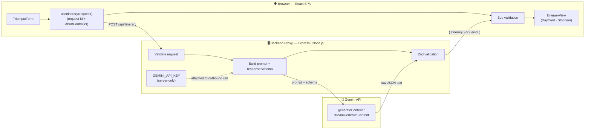

<div align="center">

# ✈️ AI Trip Planner

**Describe a trip in plain English — get back a structured, editable, day-by-day itinerary, validated end-to-end before it ever touches the screen.**

[](https://react.dev)
[](https://www.typescriptlang.org)
[](https://vitejs.dev)
[](https://expressjs.com)
[](https://vitest.dev)
[](https://zod.dev)

[]()
[](https://ai.google.dev)
[]()

</div>

<br>

A free-form trip description goes in. A Gemini-generated itinerary comes back as strict JSON, gets validated against a **shared Zod schema on both the backend and frontend**, and only then reaches the React UI as an interactive, editable list of days and stops. The model's raw text is never shown to the user — every response is treated as untrusted input until proven otherwise.

<br>

## 📑 Table of Contents

| | | |
|---|---|---|
| [✨ Features](#features) | [🏗️ Architecture](#architecture) | [🧰 Tech Stack](#tech-stack) |
| [⚙️ Prerequisites](#prerequisites) | [🚀 Setup & Startup](#setup--startup) | [📜 Scripts](#other-useful-scripts) |
| [📂 Project Structure](#project-structure) | [🧪 Testing](#testing) | [🤖 AI Usage Note](#ai-usage-note) |
| [⚠️ Known Limitations](#known-limitations) | [⏱️ Time Spent](#time-spent) | |

<br>

## ✨ Features

| | |
|---|---|
| 📝 **Free-form trip input** | A single textarea (2,000-char limit) with client-side empty/whitespace validation — no rigid multi-field form to fill out. |
| 🛡️ **Structured, AI-validated output** | Every Gemini response is parsed and checked against a shared Zod schema on **both** the backend and the frontend before it's trusted. Malformed or unexpected model output becomes a clear error state, never a crash. |
| 🧩 **Multiple AI-driven block types** | Beyond plain stops, itineraries can include cost summaries, packing checklists, and simple bar charts — each rendered with a dedicated card. Unrecognized block types fall back gracefully to the default stop view. |
| 🖱️ **Interactive, editable itinerary** | Expand/collapse any stop for full detail, remove a stop, or reorder stops with move-up/move-down controls — all immutable, keyboard-accessible state updates. |
| 🌊 **Streaming responses** | Day and stop entries render incrementally as Gemini streams them back over Server-Sent Events, with a live in-progress indicator instead of a blank loading screen. |
| 💬 **Refinement loop** | Ask for small follow-up changes ("add a coffee break," "swap day 2's museum for a park") without regenerating the whole plan from scratch. |
| 💾 **Save & reload sessions** | The last itinerary persists to `localStorage` and offers to restore it on your next visit — corrupted or unavailable storage never breaks the app. |
| 🔁 **Stale-request-safe UX** | A request-id + `AbortController` pair guarantees only the **latest** submitted request's outcome is ever rendered, no matter how fast you resubmit or how out-of-order responses arrive. |
| ♻️ **Retry & regenerate flows** | A failed retry or regenerate keeps the previous itinerary visible with a non-blocking banner instead of blanking the screen; a successful regenerate cleanly replaces it. |
| 🎨 **Accessible & responsive design** | Token-based design system with 4.5:1+ text contrast, a visible focus ring, 44px+ touch targets, full keyboard operability, dark mode, and a mobile-first layout that adapts at 768px. |

<br>

## 🏗️ Architecture



> **Why the proxy exists:** `GEMINI_API_KEY` must never reach the browser. The key lives only in the proxy's process environment, is read once per request, and is never included in any response body sent back to the client. The frontend only ever talks to same-origin `/api/itinerary` — it has zero network visibility of Gemini's endpoint or credentials. As defense in depth, the backend also runs the same Zod schema on Gemini's response *before* forwarding it, so a shape the backend itself considers invalid never reaches the frontend disguised as a `200 OK`.

<br>

## 🧰 Tech Stack

| Layer | Choice | Why |
|---|---|---|
| **Frontend** | React 18 + Vite + TypeScript | Fast cold-start dev server, zero-config TS, functional components + hooks only — no extra state library needed for the app's one meaningful piece of shared state. |
| **Backend** | Express (Node.js) | Minimal, extremely well-known, one route, trivial `npm start` story — no serverless/deploy config needed to run locally. |
| **LLM** | Google Gemini (`gemini-flash-lite-latest`) | Native JSON-mode + `responseSchema` support constrains the model's output shape; a fast, low-latency model keeps the "thinking" overhead of Gemini 3.x's reasoning models out of the critical path. |
| **Validation** | Zod (shared schema) | One schema (`shared/itinerarySchema.ts`) imported by both sides via a `@shared/*` path alias — a single source of truth for what counts as a valid itinerary, enforced identically on the server (defense in depth) and the client. |
| **Testing** | Vitest + React Testing Library | Pairs natively with Vite (same transform pipeline, no separate config), fast watch mode, first-class ESM/TS support. |
| **Styling** | CSS Modules + design tokens | No UI-kit/Tailwind dependency risk in a time-boxed build; scoped styles avoid collisions, and a single `tokens.css` keeps color/spacing/contrast consistent and easy to audit for accessibility. |

<br>

## ⚙️ Prerequisites

| Requirement | Notes |
|---|---|
| **Node.js** ≥ 18 | Required by Vite 5 and the `tsx`-based backend. Node 22+ enables the native `--env-file` flag used by the `server` script. |
| **npm** | Ships with Node — no other package manager needed. |
| **Gemini API key** | Get one for free at [Google AI Studio](https://aistudio.google.com/app/apikey). |

<br>

## 🚀 Setup & Startup

**1. Install dependencies**

A single root `package.json` covers both the frontend and backend — there are no separate `client`/`server` packages to install.

```bash
npm install
```

**2. Configure your Gemini API key**

Copy the example env file:

```bash
cp .env.example .env
```

Then edit `.env` and set the exact variable name the backend reads:

```dotenv
GEMINI_API_KEY=your-real-key-here
```

> The backend proxy (`server/server.ts`) reads `process.env.GEMINI_API_KEY` at request time. If it's missing, the API responds with a `server_misconfigured` error instead of attempting a call to Gemini — the key is only ever used server-side and is never sent to or exposed in the browser.

**3. Start the app**

Runs the Vite dev server and the Express proxy together:

```bash
npm start
```

Under the hood this is `concurrently "npm:client" "npm:server"`:

| Process | Command | Serves |
|---|---|---|
| `client` | `vite` | React frontend at `http://localhost:5173` |
| `server` | `tsx watch --env-file=.env server/server.ts` | Express proxy on port `3001` (configurable via `SERVER_PORT`) |

Vite's dev server proxies any `/api/*` request to the Express server, so the frontend only ever calls same-origin paths — no CORS setup needed.

**4. Open the app**

Visit **`http://localhost:5173`**, describe a trip, and submit.

> `npm run dev` is an alias for the exact same command as `npm start`, in case either is expected by convention.

**Stopping the app:** press <kbd>Ctrl</kbd>+<kbd>C</kbd> in the terminal running `npm start` — this stops both the Vite dev server and the Express proxy together, since they run under the same `concurrently` process.

<br>

### 📜 Other Useful Scripts

| Command | What it does |
|---|---|
| `npm test` | Runs the full test suite once with Vitest |
| `npm run build` | Builds the frontend for production with Vite |
| `npm run typecheck` | Runs `tsc --noEmit` across the whole project |

<br>

## 📂 Project Structure

```
ai-trip-planner/
├── README.md
├── package.json                  # root scripts: "start" runs client + server concurrently
├── .env.example                  # GEMINI_API_KEY=
├── shared/
│   └── itinerarySchema.ts        # Zod schema + inferred types, shared by frontend & backend
├── server/
│   ├── server.ts                 # Express app: /api/itinerary, /api/itinerary/stream, /api/itinerary/refine
│   ├── gemini.ts                 # callLLM() / streamLLM() — isolated Gemini integration
│   ├── promptBuilder.ts          # builds the system instruction + responseSchema for Gemini
│   └── streamParser.ts           # incremental Day-object extraction from a streamed response
├── src/
│   ├── main.tsx, App.tsx
│   ├── hooks/
│   │   ├── useItineraryRequest.ts   # request-lifecycle hook: request-id + AbortController
│   │   ├── useStoredItinerary.ts    # localStorage save/restore for the last itinerary
│   │   ├── useTheme.ts              # dark mode toggle + persistence
│   │   └── useGlobalShortcut.ts     # keyboard shortcuts (skipped while typing)
│   ├── lib/
│   │   ├── fetchAndValidateItinerary.ts   # fetch → parse → Zod-validate pipeline
│   │   ├── streamItinerary.ts             # SSE consumer for the streaming endpoint
│   │   ├── fetchAndValidateRefinement.ts  # refinement request pipeline
│   │   └── validateTripDescription.ts     # client-side input validation
│   ├── components/
│   │   ├── TripInputForm/                          # controlled textarea + submit
│   │   ├── ResultArea/                             # switches on request status → one state component
│   │   ├── LoadingSkeleton/, ErrorState/, EmptyState/, EmptyResultState/
│   │   ├── RetryBanner/, RestorePrompt/, StreamingIndicator/
│   │   ├── ItineraryView/, DayCard/, StopItem/
│   │   ├── RefinementForm/, ThemeToggle/
│   │   └── CostCard/, ChecklistCard/, ChartCard/   # type-specific block renderers
│   └── styles/tokens.css                # design tokens: color, spacing, type, focus ring, dark theme
├── vite.config.ts                # dev-server proxy: /api → the Express port
└── tsconfig.json                 # @shared/* path alias
```

<br>

## 🧪 Testing

The suite is weighted toward the highest-risk area first — the AI-response parse/validation pipeline — plus every component and the request-lifecycle race condition.

<div align="center">

| Metric | Result |
|---|---|
| **Test files** | 25 |
| **Tests** | 207 passing ✅ |
| **Typecheck** | `tsc --noEmit` clean ✅ |

</div>

| Area | Coverage |
|---|---|
| **Schema validation** (`shared/itinerarySchema.test.ts`) | Valid/invalid shapes, size limits, unknown-field tolerance, recognized vs. unrecognized block types |
| **Backend** (`server/*.test.ts`) | Request validation, API key guard, prompt building, Gemini response validation before forwarding, SSE streaming, refinement endpoint |
| **Frontend pipeline** (`src/lib/*.test.ts`) | Malformed JSON, non-2xx, network failure, schema-invalid bodies, streaming chunk parsing |
| **Request lifecycle** (`src/hooks/useItineraryRequest.test.ts`) | A second submission while the first is still pending correctly discards the first's late-arriving response |
| **Components** (`src/components/**/*.test.tsx`, `src/App.test.tsx`) | Every state (loading, error, empty, populated), expand/collapse, remove/reorder, retry/regenerate, restore-on-load, theme toggle |

```bash
npm test          # run the full suite once
npm run typecheck  # run the type checker
```

<br>

## 🤖 AI Usage Note

This project was built with **[Kiro](https://kiro.dev)**, an AI-powered development environment, working from a spec (`requirements.md` → `design.md` → `tasks.md`, also authored with AI assistance) broken into small, incrementally-committed tasks. Kiro wrote essentially all of the code in this repository, including:

- the shared Zod schema (`shared/itinerarySchema.ts`) and its unit tests
- the Express backend proxy, Gemini prompt-building and API integration (`server/promptBuilder.ts`, `server/gemini.ts`), streaming and refinement endpoints, and backend response validation
- the frontend request/parse/validation pipeline and the stale-response-safe request lifecycle hook (`src/hooks/useItineraryRequest.ts`)
- all React components (input form, itinerary view, day/stop/block cards, loading/error/empty states, theme toggle, restore prompt) and their CSS
- the full test suite (207 unit and integration tests across schema, backend, and frontend code) and the design-token-based accessible/responsive styling

Each task was implemented, tested, and committed one at a time rather than generated as one large drop, so the git history reflects incremental, reviewable progress. A human directed the overall architecture and requirements via the spec, reviewed the generated code and test results at each step, ran a live end-to-end verification pass against the real Gemini API (which surfaced and led to fixes for a deprecated model name, an unsupported schema field, a missing required field, and an SSE line-ending parsing bug — see [Known Limitations](#️-known-limitations)), and made the final calls on scope.

<br>

## ⚠️ Known Limitations

- **Single LLM provider.** Only Gemini is supported; there's no provider abstraction layer, since the assignment scope didn't call for multi-provider support.
- **No authentication or rate limiting** on the itinerary endpoints. This is a local evaluation project, not a hardened multi-tenant deployment — running it publicly as-is would let anyone with network access consume your Gemini quota.
- **Model availability drifts over time.** `server/gemini.ts` pins a specific Gemini model name; Google periodically deprecates/renames models, which previously caused live 404s until the model was updated during manual verification. If Gemini returns 404s again in the future, check `GET https://generativelanguage.googleapis.com/v1beta/models?key=YOUR_KEY` for currently available model names.
- **Real browser/device verification is still recommended.** The 375px / 768px / desktop layout breakpoints and the keyboard-only navigation pass were validated by code review against the design's requirements and via the automated test suite, not by driving an actual browser or device end-to-end. A manual pass with real browser dev tools (or real devices) and a screen reader is still worthwhile before shipping to production.

<br>

## ⏱️ Time Spent

Approximately **8 hours** were spent building the mandatory core (schema, backend proxy and Gemini integration, frontend request pipeline, interactive itinerary UI, accessibility and responsive styling, manual verification, and documentation), matching the project's intended time budget. Additional time was spent implementing all five optional stretch goals — multiple AI-driven block types, streaming responses, the refinement loop, save/reload sessions, and UI polish (dark mode, animations, keyboard shortcuts) — plus a live end-to-end verification pass against the real Gemini API that surfaced and fixed several integration bugs invisible to mocked tests alone.

<br>

<div align="center">

**[⬆ back to top](#-ai-trip-planner)**

</div>
